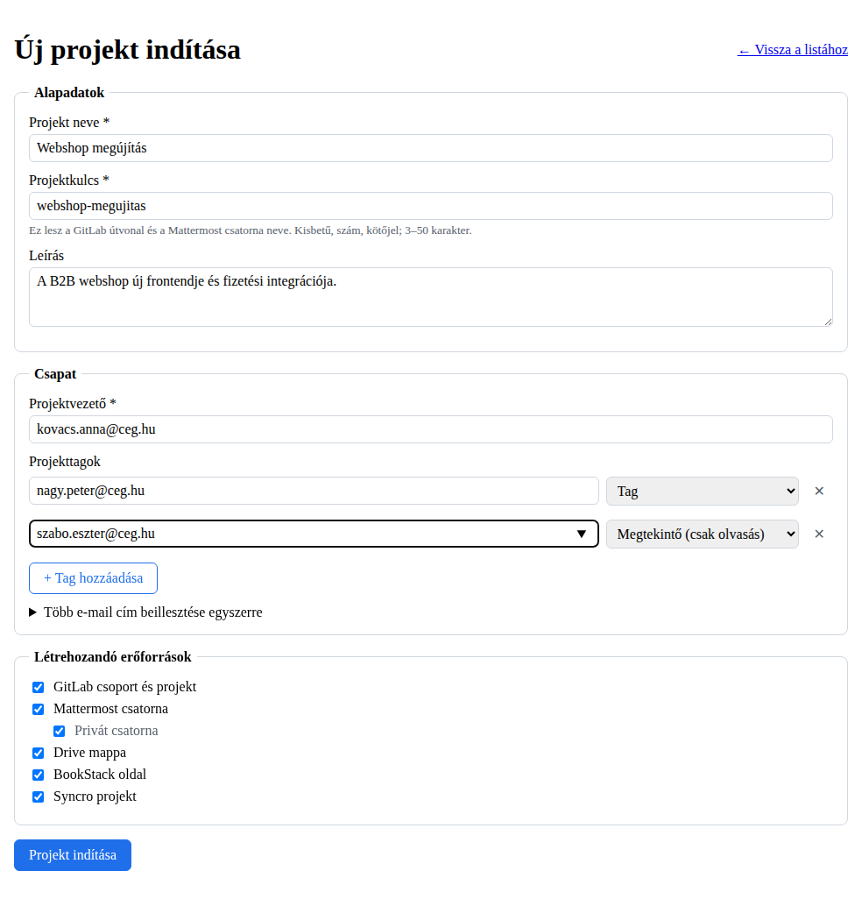
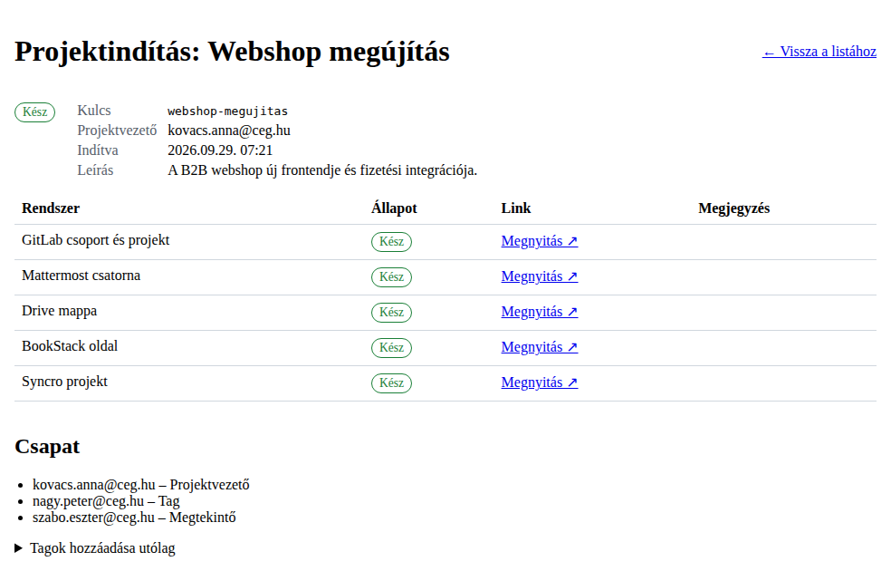

# Projektindítás modul (Spring Boot + Angular)

Egy űrlap kitöltésével egy lépésben létrejön egy új projekthez minden, ami kell:

| Rendszer | Mi jön létre | Tagok |
|---|---|---|
| **GitLab** | csoport a konfigurált szülőcsoport alatt + egy azonos nevű repo | PM: Owner, tag: Developer, megtekintő: Reporter (a repo örökli a csoporttól) |
| **Mattermost** | nyilvános vagy privát csatorna a konfigurált csapatban | mindenki bekerül a csapatba és a csatornába; a PM csatorna-admin lesz |
| **Google Drive** | projektmappa + sablon almappák (pl. Shared Drive-on) | PM és tag: szerkesztő, megtekintő: olvasó |
| **BookStack** | könyv + „Projekt áttekintés” nyitóoldal (csapattal, linkekkel), opcionálisan polcra téve | „Projekt: &lt;név&gt;” szerepkör, amit minden tag megkap, és ez kap szerkesztési jogot a könyvre |
| **Syncro** | projekt a projektvezetővel, a tagokkal és az összes fenti linkkel | – |




## Működés

- A lépések **a háttérben, sorban** futnak (GitLab → Mattermost → Drive → BookStack → Syncro). Az állapotoldal kétmásodpercenként frissül.
- **Minden lépés idempotens** („megkeresi, és ha nincs, létrehozza”), így egy hibás lépés újrafuttatása nem hoz létre duplikátumot.
- Ha egy lépés elbukik (pl. nem érhető el a Drive API), a többi attól még lefut. A hibás lépések egy gombbal **újrafuttathatók**.
- Ha egy tag nem található valamelyik rendszerben (pl. még nincs GitLab fiókja), az **figyelmeztetés**, nem hiba. Miután a fiók létrejött, az újrafuttatás felveszi.
- **Utólagos taghozzáadás:** a projekt oldalán új tagok adhatók hozzá. Ilyenkor minden lépés újrafut, és a tagok mindenhova bekerülnek.
- A Syncro lépés az utolsó, és újrafuttatáskor mindig újrafut, így mindig a friss linkeket kapja meg.
- A **projektkulcs** (pl. `webshop-megujitas`) a névből generálódik (ékezetek nélkül). Ez lesz a GitLab útvonal és a Mattermost csatornanév. Az űrlap élőben ellenőrzi, hogy foglalt-e.
- A **személyválasztó** alapból a Mattermost felhasználói között keres, de a Syncro felhasználóira is átköthető.
- Egy app-újraindítás után a félbemaradt lépések hibásra állnak, így újrafuttathatók. Az el sem indult kérések automatikusan folytatódnak.
- Minden integráció külön kapcsolható be (`kickoff.<rendszer>.enabled`). Ami ki van kapcsolva, az nem jelenik meg az űrlapon.

## Tartalom

```
backend/                      Spring Boot 3 modul (önállóan is buildelhető és tesztelhető)
  src/main/java/.../projectkickoff/
    api/                      REST controller, DTO-k, hibakezelés
    domain/                   JPA entitások, repository
    service/                  service, háttérfuttató (orchestrator), állapotkezelés
    integration/              gitlab/ mattermost/ drive/ bookstack/ syncro/ – egy-egy kliens + lépés
    people/                   személykereső (Mattermost / saját)
    config/                   konfiguráció (KickoffProperties, KickoffConfig)
  src/main/resources/application-kickoff.example.yml   példa konfiguráció
  sql/V1__project_kickoff.postgresql.sql               adatbázis migráció
frontend/project-kickoff/     Angular (17+) standalone feature: lista, űrlap, állapotoldal
INTEGRACIO.md                 lépésenkénti útmutató a meglévő projektbe építéshez
```

## Kipróbálás külső rendszerek nélkül (demó mód)

```bash
cd backend
mvn spring-boot:test-run -Dspring-boot.run.profiles=demo   # http://localhost:8080, szimulált integrációkkal
```

A demó módban minden lépés kb. 1,5 másodpercig „fut”. A `nincs...@` kezdetű e-mail címekre figyelmeztetés jön. Ha a projekt nevében szerepel a „hiba” szó, a Drive lépés elsőre elbukik, így az újrafuttatás is kipróbálható.
A frontendet bármelyik Angular appba bemásolva, egy `/api` → `localhost:8080` proxyval lehet mellé futtatni.

## Tesztek

```bash
cd backend && mvn test
```

15 teszt fut le:
- mind az 5 külső kliens tesztje, mockolt HTTP-vel (URL-kódolás, find-or-create, jogosultsági szintek, figyelmeztetések),
- a teljes folyamat REST-en keresztül, H2 adatbázissal (létrehozás, hiba, újrafuttatás, utólagos tagok, validáció),
- egy ellenőrzés, hogy a migrációs SQL egyezik az entitásokkal.

A frontend Angular 18 alatt, `strictTemplates`-szel buildelve, és Playwrighttal végigkattintva lett kipróbálva.
